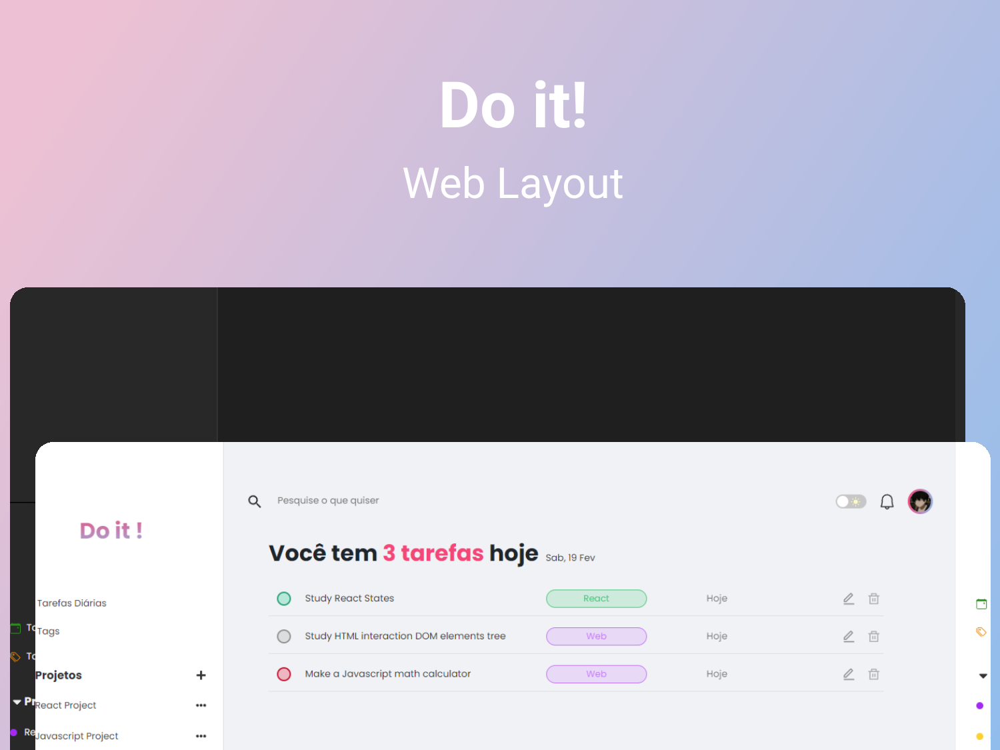

<p align="center">
  
  <span align="center"> Web </span>
 
</p>

<p align="center">
  
  
  

  
</p>

<h1 align="center">
    
</h1>

<br>

## 🧪 Technologies

This project was developed using the following technologies:

- [React](https://reactjs.org)
- [TypeScript](https://www.typescriptlang.org/)
- [SASS](https://sass-lang.com/)
- [Firebase](https://firebase.google.com/)

## 🚀 Getting started

Clone the project and access the folder.

```bash
$ git clone https://github.com/EriikGabriel/do-it.git
$ cd do-it
```

Follow the steps below:

```bash
# Install the dependencies
$ yarn

# Start the project
$ yarn start
```

The app will be available for access on your browser at http://localhost:3000

## 📝 License

This project is licensed under the MIT License. See the [LICENSE](LICENSE) file for details.

---

Developed by [Erik Gabriel](https://github.com/EriikGabriel) 🚀
